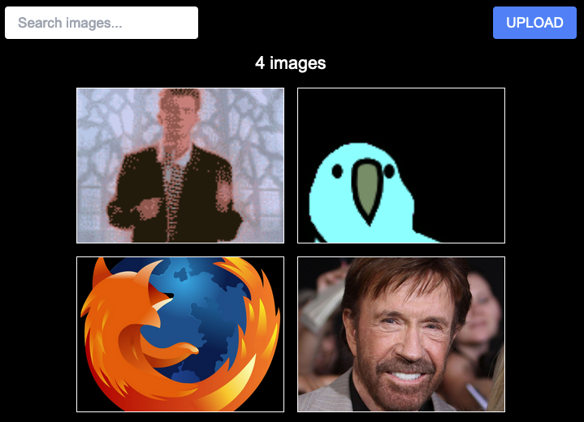

# Take-Home Exercise

Start time: Oct 16, 10:14 AM
Completion time: Oct 16, 12:11 PM

## Example



## Instructions

Simply run:
```bash
npm i
npm start
```

Please note, usually `npm dev` would be the correct command for NextJS but the instructions clearly stated that `npm start` should be the application.

## Overview

This application acts as a simple image upload and display service. It allows users to upload images and view them in a gallery. The search features fuzzy search and will return results based on the image name.

Hovering over the image presents the user with the file name as well as a delete button. Clicking the delete button will remove the image from the gallery.

The file upload only accepts images and will not allow the user to upload anything else.

The API is built using NextJS API routes and the front-end is built using NextJS and TailwindCSS.

The API itself is functional, but the storage is temporary. The files are stored in the `@/lib/storage.ts` file and are not persisted between server restarts.

## Improvements

There are a few improvements that could be made to this application.
- Add a proper datastore to persist the images between server restarts.
- Add a proper authentication system to prevent unauthorized users from uploading images.
- Add a proper file size limit to prevent users from uploading large files.
- Add filtering to the gallery to allow users to filter by file type or upload date.
- Allow user to click on image to view it in a larger format.